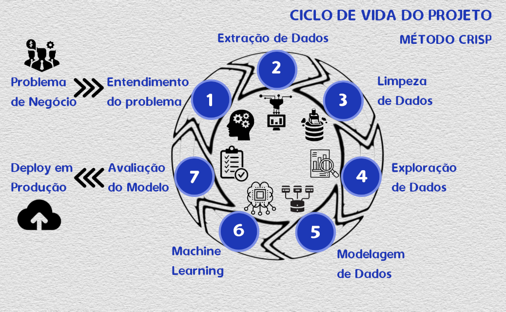
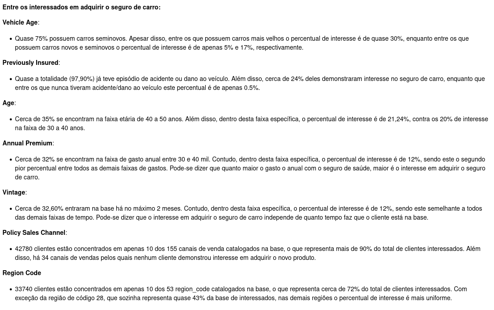
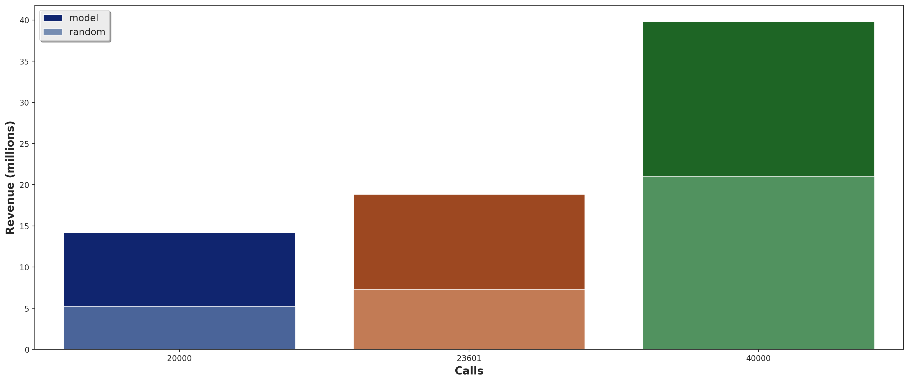

# **ENTENDIMENTO DO NEGÓCIO**

## **QUAL É A EMPRESA?**

`Insurance All`

## **QUAL É O MODELO DE NEGÓCIO?**

A Insurance All é uma empresa que fornece **seguro de saúde** para seus clientes, cujo modelo de negócio se dá da seguinte forma:

A seguradora exige um pagamento (denominado “prêmio anual”) do cliente para garantir indenizações em caso de doenças, tratamentos de saúde e quaisquer outras condições especificadas no contrato.

Assumindo que o prêmio custe $5.000 e a garantia seja de até $100.000, o cliente tem a garantia de que, por exemplo, se necessitar de um tratamento de saúde de $20.000, a seguradora o pagará (dado que é menor que o limite coberto pela garantia).

A lógica do negócio consiste em faturar com uma base enorme de clientes, milhares deles, que pagam pela garantia, mas de fato não chegam a usá-la integralmente. A empresa se vale de **conhecimentos estatísticos** e **análises de riscos** que garantem que na maioria dos casos os clientes irão demandar menos do que tem direito, onde reside o **lucro** da operação.

## **QUAL É O PROBLEMA DE NEGÓCIO?**

A equipe de produtos da Insurance All está analisando a possibilidade de oferecer um novo produto, o **seguro de automóveis**, para seus clientes que já possuem seguro de saúde.

Assim como o seguro de saúde, os clientes desse novo plano de seguro de automóveis precisam pagar um valor anualmente à Insurance All para obter um valor assegurado pela empresa, destinado aos custos de um eventual acidente ou dano ao veículo.

Ano passado, a Insurance All fez uma **pesquisa** com cerca de 380 mil clientes sobre o interesse em aderir a este novo produto. Todos os clientes responderam a esta pesquisa e demonstraram interesse ou não em adquirir o seguro de automóvel, ficando essas respostas salvas em um banco de dados junto com outros atributos dos clientes.

O time de produtos selecionou 127 mil novos clientes, que não responderam à pesquisa, para participar de uma campanha na qual receberão a **oferta do novo produto** de seguro de automóveis. A oferta será feita pelo time de vendas através de ligações telefônicas. Contudo, o time de vendas tem uma capacidade de realizar apenas 20 mil ligações dentro do período da campanha.

**Referências:**  
https://sejaumdatascientist.com/como-usar-data-science-para-fazer-a-empresa-vender-mais/


# **ENTENDIMENTO DO PROBLEMA**

## **QUAL O DESAFIO QUE ESTE PROJETO VISA SUPERAR?**

Nesse contexto, a empresa contratou um consultor de Ciência de Dados para construir um **modelo que prediz** se o cliente estaria ou não interessado no seguro de automóvel.

Com a esta solução, o time de vendas espera conseguir **priorizar as pessoas com maior interesse** no novo produto e assim, otimizar a campanha realizando apenas contatos aos **clientes mais propensos a realizar a compra**.

Como resultado desta consultoria, é necessário entregar um relatório contendo algumas análises e respostas às seguintes perguntas:

* Principais Insights sobre os atributos mais relevantes de clientes interessados em adquirir um seguro de automóvel.
* Qual a porcentagem de clientes interessados em adquirir um seguro de automóvel o time de vendas conseguirá contatar fazendo 20.000 ligações?
* E se a capacidade do time de vendas aumentar para 40.000 ligações, qual a porcentagem de clientes interessados em adquirir um seguro de automóvel o time de vendas conseguirá contatar?
* Quantas ligações o time de vendas precisa fazer para contatar 80% dos clientes interessados em adquirir um seguro de automóvel?


# **BUSINESS ASSUMPTIONS**
```
- De acordo com as informações do banco de dados, **Annual_Premium** é o valor que o cliente
precisa pagar anualmente para ter a cobertura do seguro de saúde. Não se refere portanto à
oferta do seguro de automóvel

- Com base em uma pesquisa nas referências abaixo, o **custo médio do seguro de automóveis**
foi considerado $ 1.000 por ano. Como a maioria das referências abaixo das estimativas são
mais altas, as estimativas de receita para este projeto são um tanto pessimistas.

- Eu assumi que **10%** dos interessados irão aceitar a oferta do novo seguro depois de serem
contactados.
```
**Referências:**  
https://www.bankrate.com/insurance/car/average-cost-of-car-insurance/  
https://www.policygenius.com/auto-insurance/learn/how-much-is-car-insurance/  
https://www.businessinsider.com/personal-finance/average-cost-of-car-insurance

### **O dataset possui as seguintes features**

Variable 	Definition
id 	Unique ID for the customer
Gender 	Gender of the customer
Age 	Age of the customer
Driving_License 	0 : Customer does not have DL, 1 : Customer already has DL
Region_Code 	Unique code for the region of the customer
Previously_Insured 	1 : Customer already has Vehicle Insurance, 0 : Customer doesn't have Vehicle Insurance
Vehicle_Age 	Age of the Vehicle
Vehicle_Damage 	1 : Customer got his/her vehicle damaged in the past. 0 : Customer didn't get his/her vehicle damaged in the past.
Annual_Premium 	The amount customer needs to pay as premium in the year
PolicySalesChannel 	Anonymized Code for the channel of outreaching to the customer ie. Different Agents, Over Mail, Over Phone, In Person, etc.
Vintage 	Number of Days, Customer has been associated with the company
Response 	1 : Customer is interested, 0 : Customer is not interested

|Feature             | Definição     |
|--------------------| ------------- |
|Id                  | identificador único para cada cliente |
|Gender              | gênero do cliente |
|Age                 | idade do cliente |
|Driving_License     | 0: cliente não possui CNH, 1: cliente possui CNH |
|Previously_Insured  | 0: cliente não possui seguro de automóvel, 1: cliente já possui seguro de automóvel |
|Vehicle_Age         | idade do veículo |
|Vehicle_Damage      | 0: cliente não sofreu dano no veículo no passado, 1: cliente já sofreu dano no veículo no passado |
|Annual_Premium      | montante que o cliente precisa pagar anualmente |
|PolicySalesChannel  | código anônimo do canal de venda utilizado pelo cliente |
|Vintage             | quantidade de dias que o cliente está associado à empresa |
|Response            | resposta à pesquisa: 0: não tem interesse, 1: possui interesse|  <br>

**Referências:**  
https://www.kaggle.com/anmolkumar/health-insurance-cross-sell-prediction/metadata


# **ESTRATÉGIA DA SOLUÇÃO**


### Input

- **Business problem**: ordenar os novos clientes pela propensão de aceitar a oferta do novo seguro
- **Business questions**: descritos na seção anterior
- **Dados disponíveis**: dataset com dados de 380 mil clientes que já responderam á pesquisa de interesse

### Output

- **Planilha Online** que calcula o score de propensão de compra para uma lista de clientes inputadas pelo usuário
- **Relatório** com as respostas para as seguintes perguntas de negócio:
* *Principais Insights sobre os atributos mais relevantes de clientes interessados em adquirir um seguro de automóvel.*
* *Qual a porcentagem de clientes interessados em adquirir um seguro de automóvel o time de vendas conseguirá contatar fazendo 20.000 ligações?*
* *E se a capacidade do time de vendas aumentar para 40.000 ligações, qual a porcentagem de clientes interessados em adquirir um seguro de automóvel o time de vendas conseguirá contatar?*
* *Quantas ligações o time de vendas precisa fazer para contatar 80% dos clientes interessados em adquirir um seguro de automóvel?*


### Tasks

> Quais são os atributos mais relevantes de clientes interessados em adquirir um seguro de automóvel?

* Estimar a relevância de todos os atributos através de alguns métodos de seleção de features

> Qual percentual de clientes interessados será atingido após 20 mil ligações?

* Ordenar os clientes pela propensão de compra
* Observar a métrica de *`Recall at K`* para a posição 20 mil

> Qual percentual de clientes interessados será atingido após 40 mil ligações?

* Ordenar os clientes pela propensão de compra
* Observar a métrica de *`Recall at K`* para a posição 40 mil

> Quantas ligações são necessárias para atingir 80% do total de clientes interessados?

* Determinar o cluster Insiders
* Observar a métrica de *`Recall at K`* para o valor 0.80 e retornar o valor de K


# **CICLO DO PROJETO**



## `Step 00. Settings and Data Extraction`
* Importação das bibliotecas, pacotes e funções necessárias.
* Carregamento e verificação dos dados disponíveis através de um arquivo CSV.

## `Step 01. Data Description`
* Renomeação das colunas e verificação do tamanho do dataset (avaliar a necessidade de ferramentas para tratar grande volume de dados).
* Verificação dos tipos de dados em cada coluna e mudanças de tipo que se façam necessárias para melhor tratamento pelos algoritmos posteriormente.
* Verificação de dados faltantes e decisão de como tratá-los (remoção, reamostragem artificial, inviabilidade da solução).
* Breve descrição estatística dos atributos numéricos e categóricos a fim de detectar anomalias que fogem do escopo do problema, bem como a presença de possíveis outliers que irão impactar a performance dos algoritmos posteriormente.

## `Step 02. Feature Engineering`
* Levantamento de uma lista de hipóteses de negócio.
* Criação de variáveis (features) relevantes para a resolução do problema.

## `Step 03. Data Filtering`
* Filtragem de linhas e deleção de colunas que não contém informações relevantes para a modelagem ou não ajudam a resolver o problema.

## `Step 04. Exploratory Data Analysis`
* Análise isolada de cada feature e sua relação com as demais.
* Exploração dos dados a fim de validar hipóteses de negócio e obter insights a respeito do negócio.

## `Step 05. Data Preparation`
* Separação dos dados em treino e validação.
* Balanceamento dos dados a fim de melhorar a capacidade de aprendizado dos modelos.
* Preparação dos dados a fim de ajudar os modelos de machine-learning a aprenderem e performarem com maior facilidade. Aqui são feitas Normalização, Reescala e Transformação dos dados.

## `Step 06. Feature Selection`
* Seleção das features mais relevantes para treinar os modelos. Aqui se usam algoritmos de seleção de features como o Boruta e Extra Trees.

## `Step 07. Machine Learning Modelling`
* Treino de diferentes modelos de machine learning e medição de suas respectivas performances baseado nas métricas escolhidas

## `Step 08. Models Performance`
* Realizar o cross-validation dos modelos treinados a fim de identificar e tratar possíveis problemas de overfitting.

## `Step 09. Hyperparameter Fine Tuning`
* Seleção daqueles modelos de machine learning que apresentam a melhor performance baseado nas métricas escolhidas (Recall at K)
* Escolha dos melhores valores para cada parâmetro dos modelos testados que maximizam as suas performances usando o Optuna

## `Step 10. Business Performance`
* Elaboração das respostas para as perguntas de negócio

## `Step 11. Deploy to Production`
* Criação da API (Application Programming Interface) para disponibilizar score de propensão de compra em solicitações de internet.
* Criação da planilha (Google Sheets) na qual o usuário final poderá inserir dados de clientes e obter o score calculado pela API hospedada na nuvem.(Heroku)

# **TOP 3 INSIGHTS**

### H2 - Clientes com carros novos/seminovos (menor que 2 anos), tem mais interesse em seguro de veículos.

> `Falsa`: Entre os interessados em adquirir o seguro de carro, quase 75% possuem carros seminovos. Apesar disso, entre os que possuem carros mais velhos o percentual de interesse é de quase 30%, enquanto entre os que possuem carros novos e seminovos o percentual de interesse é de apenas 5% e 17%, respectivamente.


**Sugestão**: depois da lista final de ligações a serem feitas, priorizar os clientes com veículos mais antigos.

### H8 - Apenas 10 canais de venda concentram mais de 80% dos clientes que estão interessados em adquirir seguro de veículos.

> `Verdadeira`: Entre os 155 canais de venda catalogados na base, em apenas 10 deles estão concentrados 42780 clientes interessados em adquirir o seguro de carro, o que representa mais de 90% do total de clientes interessados. Além disso, há 34 canais de vendas pelos quais nenhum cliente demonstrou interesse em adquirir o novo produto.


**Sugestão:** depois da lista final de ligações a serem feitas, investigar os 3 canais com maior número de clientes.

### H9 - Apenas 10 regiões concentram mais de 80% dos clientes que estão interessados em adquirir seguro de veículos.

> `Falsa`: Entre os 53 region_code catalogados na base, no Top-10 estão concentrados 33740 clientes interessados em adquirir o seguro de carro, o que representa cerca de 72% do total de clientes interessados. Com exceção da região de código 28, que sozinha representa quase 43% da base de interessados, nas demais regiões o percentual de interesse é mais uniforme.


# **BUSINESS RESULTS**
#### Respondendo às questões de negócio propostas

### Quais são os atributos mais relevantes de clientes interessados em adquirir um seguro de automóvel?



### Qual percentual de clientes interessados será atingido após 20 mil ligações?
* k=20000 ligações representa 26.24% da base de clientes
* Com esta quantidade de ligações é possível atingir cerca de 71.00% dos interessados


### Qual percentual de clientes interessados será atingido após 40 mil ligações?
* k=40000 ligações representa 52.48% da base de clientes
* Com esta quantidade de ligações é possível atingir cerca de 99.44% dos interessados


### Quantas ligações são necessárias para atingir 80% do total de clientes interessados?
* k=23601 ligações representa 30.96% da base de clientes
* Com esta quantidade de ligações é possível atingir cerca de 80.00% dos interessados


### Compilado dos Resultados de Negócio

<!--- [//]: <> ( ) -->

| Ligações  |  Random  |  Modelo  |  Ganho$  |
| --------- | -------- | -------- | ------- |
|  **20.000** |  5.25 milhões | **14.2** milhões | **2.7**x |
|  **23.601** |  7.30 milhões | **18.8** milhões | **2.6**x |
|  **40.000** |  21 milhões | **39.7** milhões | **1.9**x |

# - RANDOM MODEL vs ML MODEL



# **BUSINESS SOLUTION**

**A seguinte imgagem explica a arquitetura de deploy utilizada na solução deste problema**


### **Google Sheet**

Uma Planilha Google foi criada para que a equipe de vendas possa verificar facilmente a probabilidade de um cliente se interessar pelo seguro de automóvel. Com esta solução, a equipe de vendas pode simplesmente inserir os dados dos clientes e com apenas um clique obter a probabilidade de cada um demonstrar interesse na aquisição do novo seguro, podendo optar por fazer contato primeiro com aqueles que apresentam o maior *score*.

**Confira a planilha final elaborada para apresentar a solução do problema**

[//]: # (https://docs.google.com/spreadsheets/d/1fuRS5EtYqtX-nkf0gh-01Ltv6HowKl3gJbnzjlFIVUE/edit#gid=0)


# **CONCLUSÕES**

O particular problema de classificação conhecido como **Learning to rank** leva em conta algumas métricas especiais não muito usuais em típicos casos de mera determinação de qual classe pertence um determinado dado. As métricas de ranqueamento devem ser observadas com mais atenção, visto que impactam significativamente os resultados de negócios obtidos com os modelos treinados.

Neste problema em especial a priorização da métrica de Recall at K se deu pelo importante motivo de tentar reduzir a quantidade de oportunidades de negócio que poderiam ser perdidas caso o modelo deixasse de recomendar clientes potencialmente interessados (os casos de falsos negativos onde ele deixaria passar os clientes interessados). O impacto financeiro positivo será muito maior se reduzirmos os casos de falsos negativos do que os falsos positivos, pois neste último caso o prejuízo seria apenas de uma ligação perdida, e no primeiro caso, uma grande oportunidade real de negócio perdida.

# **LIÇÕES APRENDIDAS**

**Como construir uma API usando Flask e hospedar no Heroku Cloud, a fim de que uma planilha possa fazer as requisições de predição usando poucos cliques**

**Como criar um script para automatizar rotinas dentro de uma planilha no Google Sheets**

**Como desenvolver soluções intermediárias e de melhorias graduais ao longo do projeto, entregando valor mais rapidamente ao time de negócios até apresentar a solução final robusta e melhor acabada.**

**Focar na resolução de problemas de negócios de forma mais essencial do que no uso de ferramentas**

**Compreender a importância decisiva do desenvolvimento cíclico de projetos e perceber que a melhoria tanto de performance dos modelos quanto de resultados obtidos no negócio é gradualmente obtida à medida que mais ciclos são implementados**


# **PRÓXIMOS PASSOS**

**Hypothesis**: elaborar e validar mais hipóteses de negócio a fim de aprofundar o entendimento do problema.

**Code**: revisar e reescrever o código a fim de melhorar a clareza na leitura, como também diminuir o consumo de recursos computacionais.

**Google sheet**: aperfeiçoar a interface e fazer validação de dados de entrada pelo usuário.

**Features**: melhorar o desempenho dos modelos com a criação de novas features e combinações delas que sejam mais relevantes para os algoritmos e também façam sentido para o negócio.

**API**: aperfeiçoar a interface entre API e planilha reportando mensagens mais intuitivas de possíveis erros aos usuários.


# **LICENSE**

## All Rights Reserved - Comunidade DS 2021
